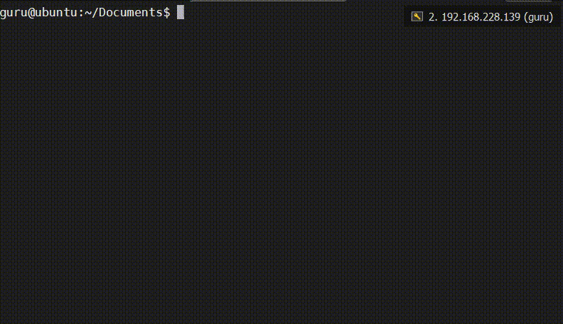
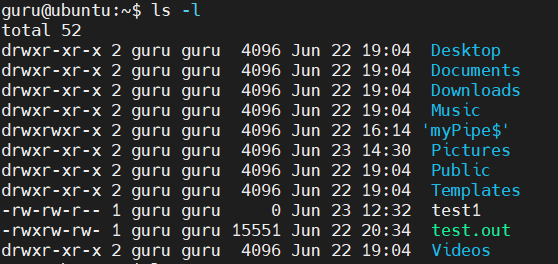
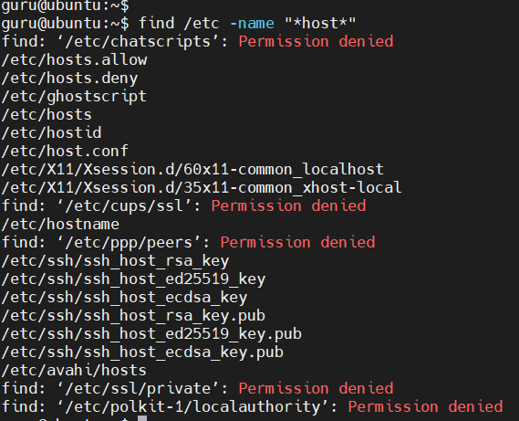

Task1.Part2
1) Examine the tree command. Master the technique of applying a template, for example,
   display all files that contain a character c, or files that contain a specific sequence of characters.
   List subdirectories of the root directory up to and including the second nesting level.
   
>ls -l /
> 
>ls -l / | grep c
> 
>ls -l / | grep [a-f]

2) What command can be used to determine the type of file (for example, text or binary)? Give an example.

>**guru@ubuntu:~$ file ./Pictures/ls_grup.gif**
>
>./Pictures/ls_grup.gif: GIF image data, version 89a, 792 x 456
> 
>**guru@ubuntu:~$ file /usr/bin/bash**
>
>/usr/bin/bash: ELF 64-bit LSB shared object, x86-64, version 1 (SYSV),
>
>dynamically linked, interpreter /lib64/ld-linux-x86-64.so.2,
>
>BuildID[sha1]=a6cb40078351e05121d46daa768e271846d5cc54, for GNU/Linux 3.2.0, stripped

3) Master the skills of navigating the file system using relative and absolute paths.
   How can you go back to your home directory from anywhere in the filesystem?
   

4) Become familiar with the various options for the ls command.
   Give examples of listing directories using different keys.
   Explain the information displayed on the terminal using the -l and -a switches.

5) Perform the following sequence of operations:
- create a subdirectory in the home directory;
- in this subdirectory create a file containing information about directories
  located in the root directory (using I/O redirection operations);
- view the created file;
- copy the created file to your home directory using relative
  and absolute addressing.
- delete the previously created subdirectory with the file requesting removal;
- delete the file copied to the home directory.

6) Perform the following sequence of operations:
- create a subdirectory test in the home directory;
- copy the .bash_history file to this directory while changing its name to labwork2;
- create a hard and soft link to the labwork2 file in the test subdirectory;
- how to define soft and hard link, what do these
concepts;
- change the data by opening a symbolic link. What changes will happen and why
- rename the hard link file to hard_lnk_labwork2;
- rename the soft link file to symb_lnk_labwork2 file;
- then delete the labwork2. What changes have occurred and why?

>mkdir Dir1
>
>cd Dir1/
>
>cp ~/.bash_history labwork2
> 
>ls -l
>
>ln labwork2 hard_labwork2
>
>ln -s labwork2 soft_labwork2
>
>ls -l
>
>cat soft_labwork2
>
>ls -l
>
>mv hard_labwork2 hard_lnk_labwork2
>
>mv soft_labwork2 symb_lnk_labwork2
>rm labwork2
>
>ls -l

7) Using the locate utility, find all files that contain the squid and traceroute sequence.
>sudo apt install locate
>
>sudo updatedb
>
>locate -A squid traceroute

8) Determine which partitions are mounted in the system, as well as the types of these partitions.

>sudo fdisk -l

9) Count the number of lines containing a given sequence of characters in a given file.

10) Using the find command, find all files in the /etc directory containing the host character sequence.
    

11) List all objects in /etc that contain the ss character sequence.
    
>guru@ubuntu:~$ find /etc -name "ss"

    How can I duplicate a similar command using a bunch of grep?
    
>guru@ubuntu:~$ grep -rl "ss" /etc/

12) Organize a screen-by-screen print of the contents of the /etc directory.
    Hint: You must use stream redirection operations.
    
>guru@ubuntu:~$ ls -la /etc > test.txt
>
>guru@ubuntu:~$ less test.txt

13) What are the types of devices and how to determine the type of device?
    Give examples.
>guru@ubuntu:~$ lspci
> 
>guru@ubuntu:~$ lsusb
> 

>guru@ubuntu:~$ lsscsi
> 

14) How to determine the type of file in the system, what types of files are there?

>guru@ubuntu:~$ file *
>

15) * List the first 5 directory files that were recently accessed in the /etc directory.
    
>guru@ubuntu:~$ ls -lt | head -6

