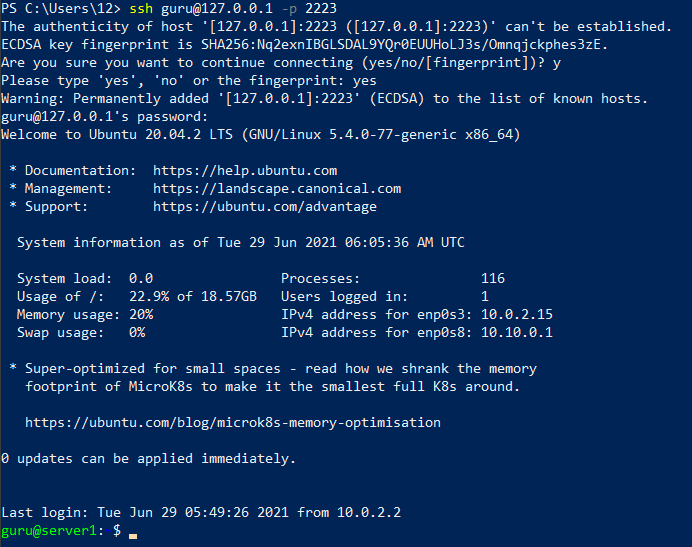

1. Check the implementability of the most frequently used OPENSSH commands in the MS Windows operating system.
   (Description of the expected result of the commands + screenshots: command – result should be presented)
   

2. Implement basic SSH settings to increase the security of the client-server connection (at least

3.List the options for choosing keys for encryption in SSH. Implement 3 of them.
4. Implement port forwarding for the SSH client from
   the host machine to the guest Linux virtual machine behind NAT.
   

5*. Intercept (capture) traffic (tcpdump, wireshark) while
   authorizing the remote client on the server using ssh, telnet, rlogin.
   Analyze the result.