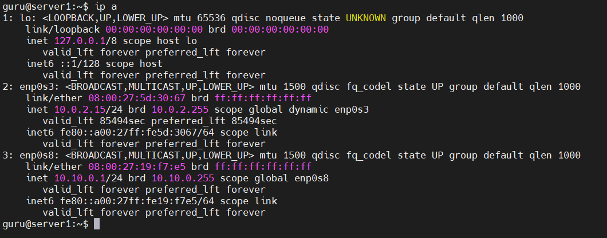
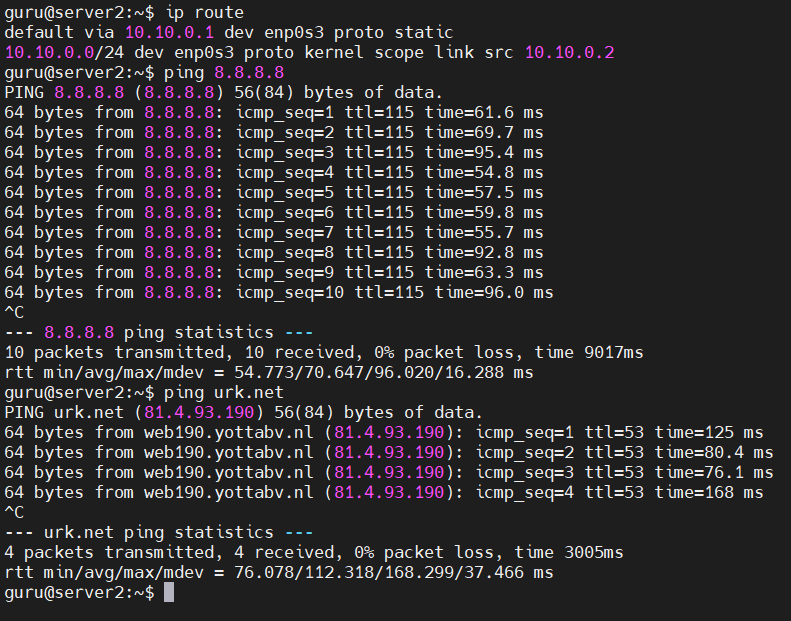
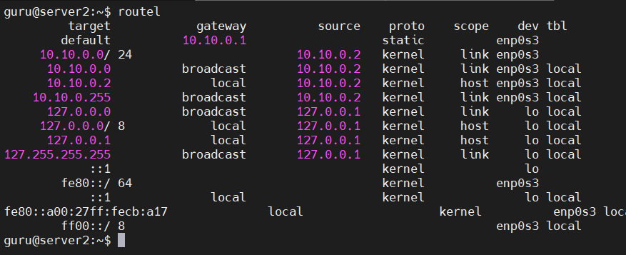

1. Create virtual machines connection according to figure 1:

2. VM2 has one interface (internal), VM1 has 2 interfaces (NAT and internal).
   Configure all network interfaces in order to make
   VM2 has an access to the Internet (iptables, forward, masquerade).
   
>server1

iptables
> guru@server1:~$ sudo iptables -t nat -A POSTROUTING -o enp0s3 -j MASQUERADE
>
>guru@server1:~$ sudo iptables -A FORWARD -i enp0s8 -o enp0s3 -m state --state RELATEDESTABLISHED -j ACCEPT
>
>guru@server1:~$ sudo iptables -A FORWARD -i enp0s8 -o enp0s3 -m state --state RELATED,ESTABLISHED -j ACCEPT
>
>guru@server1:~$ sudo iptables -A FORWARD -i enp0s8 -o enp0s3 -j ACCEPT

>server2

3. Check the route from VM2 to Host.
   

4. Check the access to the Internet, (just ping, for example, 8.8.8.8).
   

5. Determine, which resource has an IP address 8.8.8.8.
   

6. Determine, which IP address belongs to resource epam.com.
   

7. Determine the default gateway for your HOST and display routing table.
   

8. Trace the route to google.com.

>guru@server1:~$ mtr google.com

